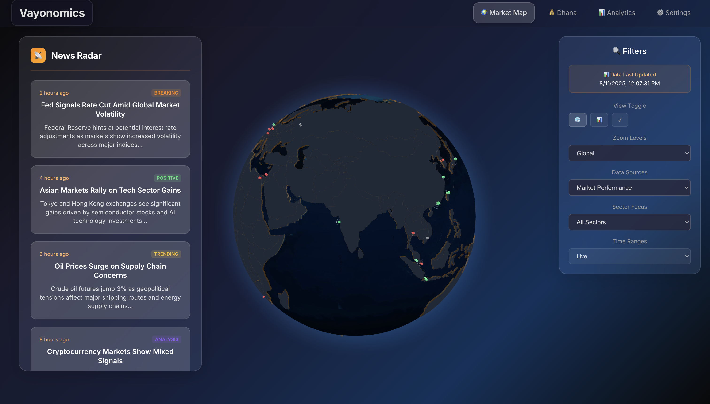

# MarketMap Frontend

A React application that visualizes global financial market indices on an interactive 3D globe with real-time data updates.

## Features

- 🌍 Interactive 3D globe visualization
- 📊 Real-time market data updates every 60 seconds
- 🎨 Color-coded market performance indicators
- [ ] 📱 Responsive design for all devices
- 🔄 Auto-rotating globe with smooth interactions

## Tech Stack

- React 19.1.1
- react-globe.gl for 3D globe rendering
- Mapbox GL for mapping functionality
- Inter font for modern typography

## Getting Started
TBD